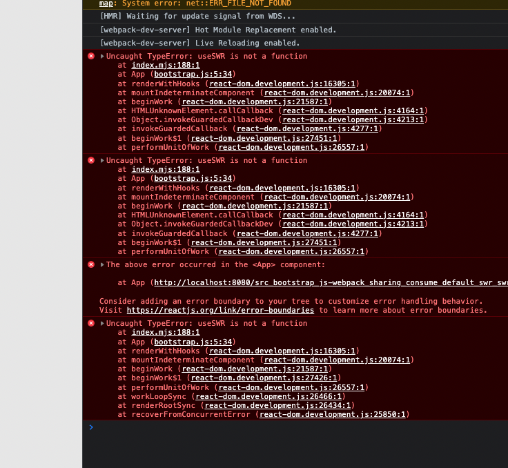

# Minimal project to find the bug with Module Federation (SharePlugin) and SWR

When use `swr/infinite` with `swr>1.1.2` dependency and sharing it with [Module Federation (SharePlugin)](https://webpack.js.org/concepts/module-federation/)
```js
    new webpack.container.ModuleFederationPlugin({
      shared: ['swr'],
    }),
```

We encountered this error:


When we remove the `swr` from the shared array, everything works fine.:


You can see SWR change log here:
https://github.com/vercel/swr/compare/1.1.2...1.2.0